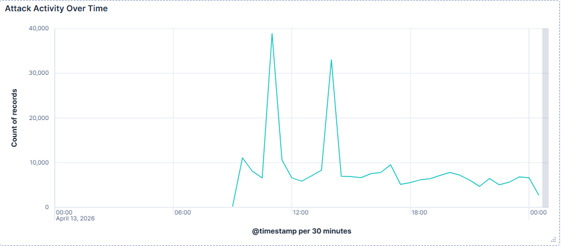
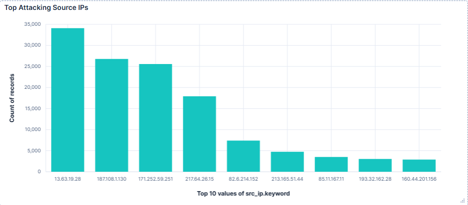
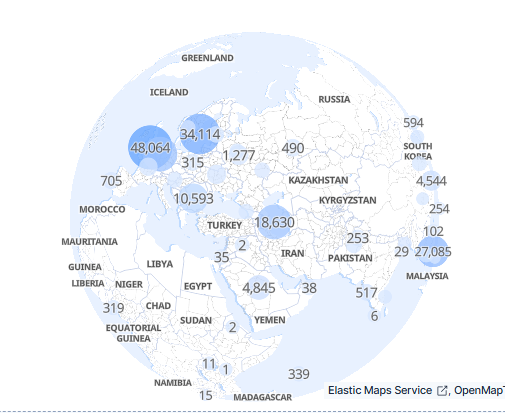
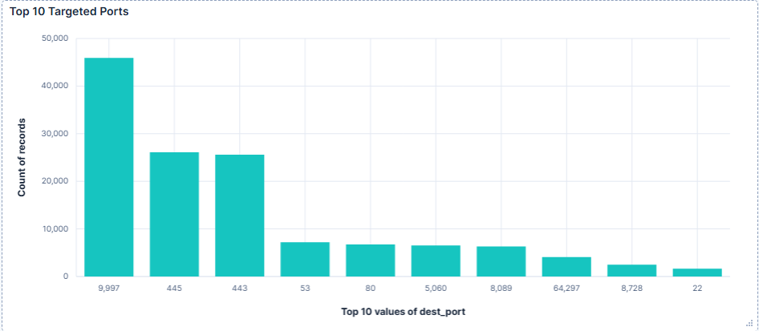
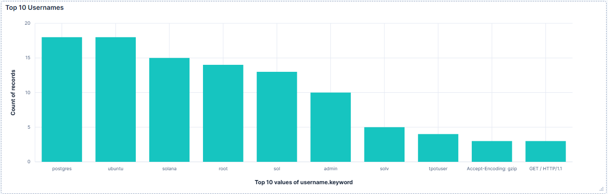
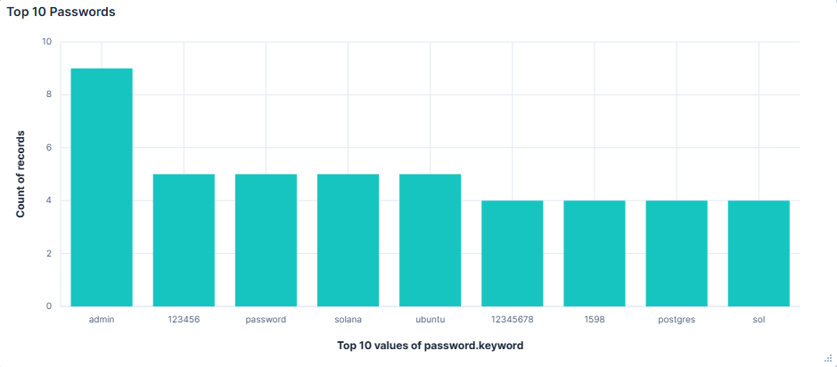

# 🛡️ T-Pot Honeypot Attack Analysis

## 📌 Overview

This project demonstrates a real-world honeypot deployment using T-Pot on a cloud-hosted server to capture and analyse live cyber attack activity.

The objective was to simulate an exposed system and observe attacker behaviour in real time.

---

## ⚙️ Environment

* Platform: DigitalOcean Droplet
* OS: Ubuntu
* Honeypot Framework: T-Pot
* Tools:

  * Elastic Stack (Kibana, Elasticsearch)
  * Cowrie (SSH/Telnet honeypot)

---

## 📊 Key Findings

### ⏱️ Attack Activity

* Attack traffic occurred in bursts rather than a constant flow
* Large spikes indicate automated scanning or coordinated probing
* Continuous low-level activity suggests ongoing internet-wide scanning

---

### 🌐 Source of Attacks

* Traffic originated from multiple global IP addresses
* Behaviour consistent with botnet-driven or automated scanning

---

### 🚪 Targeted Ports

* Common ports targeted:

  * 445 (SMB)
  * 443 (HTTPS)
  * 80 (HTTP)
  * 53 (DNS)

* High-numbered ports such as **9997** were also heavily targeted, indicating broad and opportunistic scanning rather than targeting specific services

---

### 🔐 Credential Attacks

* Common usernames:

  * root, admin, user, sol

* Common passwords:

  * 123456, password, sol, solana

* Indicates:

  * Brute-force attacks
  * Credential stuffing
  * Use of default and weak credentials

---

## 🌍 Visualisations

### Attack Timeline

### Top Attacking IPs

### Geo Location Map

### Targeted Ports

### Username Analysis

### Password Analysis

---

## 🧠 Conclusion

The honeypot captured real-world attack behaviour, showing how quickly exposed systems are targeted by automated threats.

The data highlights:

* Continuous scanning of internet-facing systems
* High reliance on weak credentials by attackers
* The importance of securing exposed services

---

## 🚀 Skills Demonstrated

* SIEM (Elastic / Kibana)
* Log Analysis
* Threat Detection
* Data Visualisation
* Cloud Deployment
* Linux Administration

---

